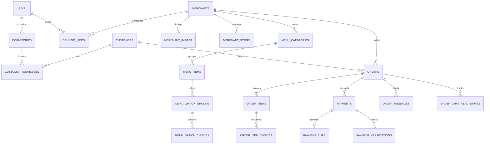

# DATABASE SCHEMA V3

## Finance 008 — current additive schema

Migrations 001–008 are complete locally, pending 0. There are now **49 application tables / 51 public tables**. Migration 008 creates 12 Finance tables (149 columns): finance_policy_versions, platform_payment_recipients, order_financial_snapshots, financial_accounts, financial_transactions, financial_postings, merchant_payout_accounts, merchant_withdrawals, finance_refunds, finance_transfers, advertising_orders, finance_reconciliation_cases.

Seven new columns across merchants/orders/payments/promotions/coupons; existing migrations unchanged. system_settings gets a private finance.runtime row. See [implemented catalog](docs/FINANCE_SCHEMA_IMPLEMENTED.md) for every column, constraint, index and trigger, and [implementation report](docs/FINANCE_SPRINT_REPORT.md) for current behavior. Earlier counts below are historical phase records.

Backfill is explicitly legacy: existing orders LEGACY_DIRECT with null platform recipient, existing campaign funding LEGACY_UNKNOWN. No commission, balance or journal backfill. New normal campaigns require MERCHANT or PLATFORM. Financial postings are append-only, protected by deferred aggregate balance triggers; financial history cannot be hard-deleted. Finance migration down intentionally refuses destructive rollback.

Status: approved baseline plus additive migrations 002–006. Current local schema has 36 application tables.
The executable baseline is `backend/migrations/202610020001_initial_schema.cjs`.

## Design rules

- PostgreSQL with integer surrogate `id` primary keys.
- One order belongs to exactly one customer and one merchant.
- Customer identity is LINE Login/LIFF first. The canonical field name is
  `line_user_id`; notifications use Messaging API and Webhook.
- Merchant staff identities are separate from the merchant business entity.
- Historical orders use typed snapshots. They never depend on mutable menu, address,
  or option names/prices to render an old receipt.
- Payment ledger data is durable. Slip objects and redacted provider responses have
  independent retention timestamps.
- Money uses `numeric(12,2)` and must be nonnegative. Phone and PromptPay identifiers
  are strings. All business timestamps use `timestamptz`.
- Status fields use strings protected by named CHECK constraints rather than native
  PostgreSQL ENUM types, so status sets can evolve through normal migrations.
- Images live in object storage; the database stores URLs for public catalog images
  and object keys for private slip/chat objects.

## Tables

Schema V3 baseline contains 20 application tables. Production hardening migration
`202610020002_production_hardening.cjs` adds three operational tables and Admin Backoffice
migration `202610050003_admin_backoffice.cjs` adds six management tables without editing earlier migrations:

1. `sois`
2. `dormitories`
3. `customers`
4. `customer_addresses`
5. `merchants`
6. `merchant_images`
7. `merchant_staffs`
8. `delivery_fees`
9. `menu_categories`
10. `menu_items`
11. `menu_option_groups`
12. `menu_option_choices`
13. `orders`
14. `order_items`
15. `order_item_choices`
16. `payments`
17. `payment_slips`
18. `payment_verifications`
19. `order_messages`
20. `order_chat_read_states`
21. `idempotency_keys` (additive)
22. `line_webhook_events` (additive)
23. `notification_outbox` (additive)
24. `platform_admins` (additive)
25. `platform_admin_sessions` (additive)
26. `audit_logs` (additive)
27. `banners` (additive)
28. `promotions` (additive)
29. `system_settings` (additive)
30. `promotion_redemptions` (Phase F, additive migration 004)
31. `merchant_opening_hours` (Phase G, additive migration 005)
32. `reviews` (Phase H, additive migration 006)
33. `customer_favorite_merchants` (Phase H, additive migration 006)
34. `coupons` (Phase H, additive migration 006)
35. `coupon_redemptions` (Phase H, additive migration 006)
36. `customer_notifications` (Phase H, additive migration 006)
37. `integration_settings` (Admin Integrations, additive migration 007)

Knex also creates its own `knex_migrations` and `knex_migrations_lock` metadata tables.

### Admin Integrations — migration 007

`202610090007_integration_settings.cjs` adds one private singleton table; no existing table is altered.
`id SMALLINT PRIMARY KEY CHECK (id = 1)`, `normal_values JSONB NOT NULL DEFAULT '{}'`,
`secret_values JSONB NOT NULL DEFAULT '{}'`, `version INTEGER NOT NULL DEFAULT 0 CHECK (version >= 0)`,
nullable `updated_by_admin_id` FK to `platform_admins` (SET NULL), and created/updated timestamptz.
Both JSONB columns require objects. Secret entries are versioned AES-256-GCM envelopes; the master
key exists only in server environment. A locked row/version check and audit insert make writes atomic.
No extra index is needed beyond the singleton PK. No seeds/backfill are added; no row exists until a save.
Rollback refuses to drop a populated table. This is not the frozen Finance foundation migration.
Current total: **37 application tables**, plus two Knex metadata tables.

## Production hardening additions

- `idempotency_keys`: customer-scoped `scope + idempotency_key` unique key, SHA-256 request
  fingerprint, processing/completed status, stored HTTP result and expiry timestamps. PostgreSQL
  advisory locks serialize concurrent submissions across app instances.
- `line_webhook_events`: unique LINE `webhook_event_id`, event hash/type, processing status,
  processed timestamp and safe error code. Records older than the configured retention window may
  be purged after operational review.
- `notification_outbox`: unique dedupe key per order event, recipient LINE user ID, immutable Flex
  payload, attempts, next retry time, sent time and safe error code. Order state and its outbox row
  are committed in the same transaction.
- `orders.delivering_at timestamptz NULL`: records the successful `READY → DELIVERING` transition.
- Active staff usernames are globally unique case-insensitively so password login by username is
  deterministic. Existing merchant-scoped uniqueness remains in place.

## Admin Backoffice additions

- `platform_admins`: case-insensitive active username uniqueness, bcrypt password hash, role
  (`SUPER_ADMIN`, `ADMIN`, `SUPPORT`, `FINANCE`), activation and login timestamps.
- `platform_admin_sessions`: SHA-256 hashes of session/CSRF tokens, expiry, revocation, idle activity,
  source IP and user agent. Raw session credentials are never stored.
- `audit_logs`: append-only application audit records with actor/action/entity/request metadata.
  Sensitive keys are recursively redacted before insert.
- `banners`: private image object key, global/merchant scope, target, draft/scheduled/published/archive
  status, start/end window and sort order. Customer Home resolves images through a controlled API.
- `promotions`: percentage, fixed amount and free delivery rules; authoritative checkout calculations
  and locked quota consumption are implemented in Phase F.
- `system_settings`: allowlisted non-secret JSON settings only. Provider/database/session secrets remain
  environment variables.
- `merchants.is_active`, suspension timestamp/reason/admin FK keep account suspension distinct from
  the store's operational `is_open` state.

## Entity relationships

## Location and customer

### `sois`

- `id` PK
- `name` NOT NULL UNIQUE
- `is_active` NOT NULL DEFAULT true
- `created_at`, `updated_at`

### `dormitories`

- `id` PK
- `soi_id` FK → `sois.id`, NOT NULL
- `name`, `location_text`, `is_active`
- UNIQUE `(soi_id, name)`

### `customers`

- `id` PK
- `line_user_id` NOT NULL UNIQUE
- `display_name`, `profile_image_url`, `phone`, `email`
- `is_active`, `created_at`, `updated_at`

Customers do not have local passwords or Google authentication columns in V3.

### `customer_addresses`

- `id` PK
- `customer_id` FK → `customers.id`, NOT NULL
- `dormitory_id` FK → `dormitories.id`, NOT NULL
- `label`, `room_number`, `contact_phone`, all NOT NULL
- `address_detail`, `is_default`, `created_at`, `updated_at`
- Partial UNIQUE `(customer_id) WHERE is_default`
- UNIQUE `(id, customer_id)` supports ownership-safe order references

## Merchant and menu

### `merchants`

- `id` PK
- `store_name`, `phone`, `location_text`, NOT NULL
- `promptpay_identifier_type`: `PHONE`, `NATIONAL_ID`, `TAX_ID`, `EWALLET`
- `promptpay_id` NOT NULL
- `prefix` NOT NULL UNIQUE
- `last_order_number >= 0`, `is_open`
- `created_at`, `updated_at`, `deleted_at`

Merchant authentication belongs to `merchant_staffs`; a merchant row is not a person.

### `merchant_images`

- `id` PK; `merchant_id` FK → `merchants.id`
- `image_url`, `alt_text`, `sort_order`, `is_primary`, `created_at`
- Partial UNIQUE `(merchant_id) WHERE is_primary`

### `merchant_staffs`

- `id` PK; `merchant_id` FK → `merchants.id`
- `username`, `password_hash`, `full_name`, `phone`
- `line_user_id` nullable UNIQUE
- `role`: `MANAGER`, `CASHIER`, `KITCHEN`, `RIDER`
- `is_active`, `created_at`, `updated_at`, `deleted_at`
- Partial UNIQUE `(merchant_id, username) WHERE deleted_at IS NULL`
- UNIQUE `(id, merchant_id)` supports same-merchant rider assignment

### `delivery_fees`

- `id` PK; `merchant_id` and `soi_id` FKs
- `fee >= 0`
- UNIQUE `(merchant_id, soi_id)`

### `menu_categories`

- `id` PK; `merchant_id` FK
- `name`, `sort_order`, `is_active`
- `created_at`, `updated_at`, `deleted_at`
- Partial UNIQUE `(merchant_id, name) WHERE deleted_at IS NULL`
- UNIQUE `(id, merchant_id)` supports tenant-safe menu references

### `menu_items`

- `id` PK; `merchant_id` FK
- Composite FK `(category_id, merchant_id)` → `menu_categories(id, merchant_id)`
- `name`, `description`, `image_url`, `price`
- `is_available`; nullable `stock_quantity` means unlimited stock
- `sort_order`, `created_at`, `updated_at`, `deleted_at`
- CHECK price/stock/sort order are nonnegative
- UNIQUE `(id, merchant_id)` supports same-merchant order items

### `menu_option_groups`

- `id` PK; `menu_item_id` FK
- `name`, `is_required`, `min_choices`, `max_choices`, `sort_order`
- CHECK `0 <= min_choices <= max_choices`; required groups have `min_choices >= 1`

### `menu_option_choices`

- `id` PK; `option_group_id` FK
- `name`, `extra_price`, `is_available`, `sort_order`
- CHECK price and sort order are nonnegative

## Orders and snapshots

### `orders`

- `id` PK; `order_code` UNIQUE
- `customer_id` FK; `merchant_id` FK
- `merchant_order_number`; UNIQUE `(merchant_id, merchant_order_number)`
- Composite FK `(customer_address_id, customer_id)` ensures address ownership
- Composite FK `(assigned_rider_id, merchant_id)` ensures same-merchant assignment
- `delivery_type`: `DELIVERY`, `PICKUP`
- `status`: `PENDING`, `ACCEPTED`, `PREPARING`, `READY`, `DELIVERING`,
  `COMPLETED`, `CANCELLED`, `REJECTED`
- `payment_method`: `PROMPTPAY`, `COD`
- `payment_status`: `UNPAID`, `PENDING_VERIFICATION`, `PAID`, `FAILED`,
  `REFUNDED`, `CANCELLED`
- `subtotal_amount`, `delivery_fee`, `discount_amount`, `total_amount`;
  total must equal subtotal + fee - discount (constraint updated by migration 004)
- `promotion_id` nullable FK → `promotions.id` (RESTRICT), `promotion_snapshot` nullable JSONB.
  Historical rows default to discount 0 and no promotion. A linked promotion requires an object
  snapshot; no promotion requires a null snapshot and zero discount.
- Delivery snapshot: `delivery_address_label`, `delivery_soi_name`,
  `delivery_dormitory_name`, `delivery_location_text`, `delivery_room_number`,
  `delivery_contact_phone`
- `delivery_note` is separate from item notes
- `accepted_at`, `completed_at`, `cancelled_at`, `created_at`, `updated_at`

DELIVERY requires a complete typed address snapshot. PICKUP requires no delivery
address and has a zero delivery fee.

### `order_items`

- `id` PK
- Composite FK `(order_id, merchant_id)` → `orders(id, merchant_id)`
- Nullable composite FK `(menu_item_id, merchant_id)` → `menu_items(id, merchant_id)`
- Snapshot fields: `item_name`, `unit_price`
- `quantity > 0`, `note`, `is_completed`

### `order_item_choices`

- `id` PK; `order_item_id` FK
- Nullable `menu_option_choice_id` FK
- Snapshot fields: `choice_name`, `extra_price`

Master references can be nullable for historical records; snapshot values are required.

## Payment

### Phase F `promotion_redemptions`

- `id` PK; `order_id` UNIQUE FK → orders; `promotion_id` FK → promotions;
  `customer_id` FK → customers. All are NOT NULL and use RESTRICT deletion.
- `discount_amount numeric(12,2) >= 0`, `created_at timestamptz`.
- Indexes `(promotion_id, created_at)` and `(customer_id, created_at)`.
- One promotion per order, no stacking. The order snapshot records immutable display/rule values,
  integer discount satang, calculation version and quota policy.
- Merchant and promotion rows lock in that order. Insert order/redemption, increment usage_count,
  and complete the existing idempotency record in one transaction. Quotation never consumes quota.
- Quota counts created orders, including cancelled/rejected/unpaid orders; no automatic release.
  Admin cannot lower usage_limit below usage_count. Replayed idempotent responses consume nothing.
- Percentage/fixed discounts apply to food subtotal (including options), free delivery to the fee;
  round percentage half up to one satang, apply maximum cap, and never exceed the applicable base.
  Minimum spend is food subtotal. Scope is global when merchant_id is NULL.
- Zero-pay checkout is explicitly rejected because the existing PromptPay flow requires a payment;
  this phase does not invent automatic paid/fulfillment behavior for a zero amount.

### `payments`

- `id` PK; `order_id` FK
- `method`: `PROMPTPAY`, `COD`
- `status`: `PENDING`, `SUBMITTED`, `PROCESSING`, `PAID`, `FAILED`,
  `CANCELLED`, `REFUNDED`
- `verification_status`: `NOT_REQUIRED`, `PENDING`, `PROCESSING`, `VERIFIED`,
  `REJECTED`, `ERROR`
- `expected_amount`, `amount_transferred`, `provider`
- `transaction_reference`, `verified_at`, `paid_at`, timestamps
- Partial UNIQUE `transaction_reference` when present
- Partial UNIQUE `order_id WHERE status = 'PAID'`
- COD uses `verification_status = NOT_REQUIRED`

### `payment_slips`

- `id` PK; `payment_id` FK NOT NULL UNIQUE
- `object_key`, `file_hash` UNIQUE
- `uploaded_at`, `purge_after`, `deleted_at`

Deleting an expired private image never deletes the durable payment reference.

### `payment_verifications`

- `id` PK; `payment_id` FK
- `provider`, `provider_request_id`; UNIQUE together when request ID is present
- `status`, `failure_code`, `provider_transaction_reference`
- `reported_amount`, `amount_matches`, `recipient_matches`
- `provider_response JSONB` containing only redacted/allowlisted data
- `verified_at`, `response_purge_after`, `created_at`

## Order chat foundation

Chat tables are part of V3, but chat API/realtime/notification logic is deferred.

### `order_messages`

- `id` PK; `order_id` FK
- `sender_type`: `CUSTOMER`, `STAFF`, `SYSTEM`
- Nullable `sender_customer_id` or `sender_staff_id` with exactly-one-actor CHECK
- `sender_role_snapshot`: customer/staff role/system
- `message_type`: `TEXT`, `IMAGE`, `SYSTEM`
- `content_text`, private `object_key`, `created_at`

### `order_chat_read_states`

- `id` PK; `order_id` FK
- `reader_type`: `CUSTOMER`, `STAFF`
- Nullable `customer_id` or `staff_id` with exactly-one-actor CHECK
- `last_read_message_id` FK → `order_messages.id`, ON DELETE SET NULL
- Partial UNIQUE per `(order_id, customer_id)` and `(order_id, staff_id)`

## Deferred from the current schema/runtime

- `order_status_events`: durable status timeline remains deferred to avoid changing the established
  customer/merchant/kitchen/rider transition services in this phase.
- Business logic and UI for order chat remain deferred; `order_messages` and
  `order_chat_read_states` are schema-ready only.
- Refund automation and automatic stock reservation/decrement are not implemented.

## Phase G — additive migration 005

`202610060005_merchant_opening_hours.cjs` adds `merchant_opening_hours` only (31 application
 tables after 005). Migrations 001–004 are unchanged in Phase G.

| Column | Constraint / meaning |
|---|---|
| id | BIGSERIAL PK |
| merchant_id | BIGINT NOT NULL FK merchants.id |
| day_of_week | SMALLINT NOT NULL, CHECK 0–6, Sunday=0 |
| open_time / close_time | TIME, Bangkok local wall clock |
| is_closed | BOOLEAN NOT NULL DEFAULT false |
| created_at / updated_at | TIMESTAMPTZ NOT NULL |

UNIQUE (merchant_id, day_of_week) also supplies the merchant schedule lookup index.
CHECK: closed day OR non-null times with close_time > open_time. API saves all seven days
atomically, or an empty array to remove scheduling. No overnight/multiple daily intervals.
`merchants.is_open` remains the manual switch; false takes precedence. Missing schedule
preserves the previous behavior. Browse returns OPEN/CLOSED/MANUALLY_CLOSED;
checkout and order creation enforce the same schedule under the existing merchant row lock.
Down migration drops only the schedule table.

No stock accounting, audit, staff, image, order or payment schema change. Category/menu deletion
uses existing deleted_at; option deletion nulls historical master-choice FK while keeping all
receipt snapshot fields. Removing a gallery entry unlinks the object; it does not erase payment
or order records. Gallery/menu upload objects use private `merchant/<merchant-id>/<uuid>.<ext>`
and `menu/<merchant-id>/<uuid>.<ext>` keys; image_url stores the backend catalog delivery route.

## Phase H — additive migration 006

`202610070006_customer_engagement.cjs` adds five customer-engagement tables and nullable coupon
snapshot columns to `orders` (36 application tables after 006). Migrations 001–005 are unchanged.

### `reviews`

- `id` PK; `order_id` UNIQUE FK; `customer_id` and `merchant_id` FKs.
- `rating` is an integer from 1–5; `comment` is optional and limited to 1,000 trimmed characters by
  the API; `status` is `PUBLISHED` or `HIDDEN`.
- Indexes `(merchant_id,status,created_at)` and `(customer_id,created_at)`. The service derives the
  customer and merchant from a customer-owned `COMPLETED` order.

### `customer_favorite_merchants`

- `id` PK; customer and merchant FKs; `created_at`.
- UNIQUE `(customer_id,merchant_id)` makes add idempotent; index `(customer_id,created_at)` supports
  the profile and Home sections. A suspended merchant remains in history and is shown unavailable.

### `coupons` and `coupon_redemptions`

- Coupon fields include a normalized `code`, name/description, nullable merchant scope, type
  (`PERCENTAGE`, `FIXED_AMOUNT`, `FREE_DELIVERY`), amount/cap/minimum, schedule, global and
  per-customer limits, `usage_count`, active/deleted state and nullable Admin creator.
- A partial UNIQUE index on `lower(code)` applies while `deleted_at IS NULL`; eligibility/scope
  indexes cover active schedule and merchant lookups.
- Redemptions contain coupon/customer/order FKs, immutable discount amount and creation time.
  `order_id` is UNIQUE; indexes cover coupon and customer histories.
- Coupon resolution, quota validation, order insert, redemption insert and usage increment share
  one transaction and a coupon row lock. Quota is consumed at order creation and is not released
  automatically for a later cancellation or rejection.
- `orders.coupon_id` and `orders.coupon_snapshot` are nullable. The replacement check constraint
  enforces exactly one discount source: no discount, automatic promotion, or coupon. `discount_amount`
  stays authoritative; snapshots contain identifier/code/name/type, calculation version,
  `discount_satang`, schedule and quota policy for historical display.

### `customer_notifications`

- `id` BIGSERIAL PK; customer FK; provider-independent type/title/message; nullable order FK;
  `is_read`; `created_at`; unique `event_key` for domain-event deduplication.
- Types: `PAYMENT_VERIFIED`, `ORDER_ACCEPTED`, `PREPARING`, `READY`, `DELIVERING`, `COMPLETED`,
  `REJECTED`, `PROMOTION`.
- Index `(customer_id,is_read,created_at)` supports unread counts and history. Order events write this
  projection transactionally before optional LINE outbox delivery, so provider failures do not lose
  customer history or expose LINE payloads.

Migration 006 rollback refuses to run if review, favourite, redemption or notification history exists,
or if an order references a coupon. This prevents silent deletion of customer and financial history;
unused coupon definitions are removed with the table during an intentional down.

### Merchant recipient overrides (no schema change)

The existing integration_settings.secret_values JSONB also holds encrypted JSON entries keyed
MERCHANT_RECIPIENT_<merchant_id>, containing promptpayType/promptpayId/bankCode/bankNumber/enabled.
AES-256-GCM field binding, singleton version locking and atomic audit apply. These entries are not
returned in generic field reads or reveal APIs. Merchant existence is checked under a row lock;
no new FK/table/index or backfill is introduced. Total remains 37 application + 2 Knex tables.
