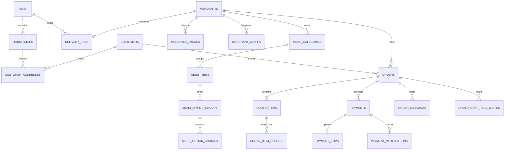

# DATABASE SCHEMA V3

Status: approved for the initial local migration. Reviews and banners are deferred.
The executable baseline is `backend/migrations/202610020001_initial_schema.cjs`.

## Design rules

- PostgreSQL with integer surrogate `id` primary keys.
- One order belongs to exactly one customer and one merchant.
- Customer identity is LINE Login/LIFF first. The canonical field name is
  `line_user_id`; notifications use Messaging API and Webhook.
- Merchant staff identities are separate from the merchant business entity.
- Historical orders use typed snapshots. They never depend on mutable menu, address,
  or option names/prices to render an old receipt.
- Payment ledger data is durable. Slip objects and redacted provider responses have
  independent retention timestamps.
- Money uses `numeric(12,2)` and must be nonnegative. Phone and PromptPay identifiers
  are strings. All business timestamps use `timestamptz`.
- Status fields use strings protected by named CHECK constraints rather than native
  PostgreSQL ENUM types, so status sets can evolve through normal migrations.
- Images live in object storage; the database stores URLs for public catalog images
  and object keys for private slip/chat objects.

## Tables

Schema V3 baseline contains 20 application tables. Production hardening migration
`202610020002_production_hardening.cjs` adds three operational tables without editing the baseline:

1. `sois`
2. `dormitories`
3. `customers`
4. `customer_addresses`
5. `merchants`
6. `merchant_images`
7. `merchant_staffs`
8. `delivery_fees`
9. `menu_categories`
10. `menu_items`
11. `menu_option_groups`
12. `menu_option_choices`
13. `orders`
14. `order_items`
15. `order_item_choices`
16. `payments`
17. `payment_slips`
18. `payment_verifications`
19. `order_messages`
20. `order_chat_read_states`
21. `idempotency_keys` (additive)
22. `line_webhook_events` (additive)
23. `notification_outbox` (additive)

Knex also creates its own `knex_migrations` and `knex_migrations_lock` metadata tables.

## Production hardening additions

- `idempotency_keys`: customer-scoped `scope + idempotency_key` unique key, SHA-256 request
  fingerprint, processing/completed status, stored HTTP result and expiry timestamps. PostgreSQL
  advisory locks serialize concurrent submissions across app instances.
- `line_webhook_events`: unique LINE `webhook_event_id`, event hash/type, processing status,
  processed timestamp and safe error code. Records older than the configured retention window may
  be purged after operational review.
- `notification_outbox`: unique dedupe key per order event, recipient LINE user ID, immutable Flex
  payload, attempts, next retry time, sent time and safe error code. Order state and its outbox row
  are committed in the same transaction.
- `orders.delivering_at timestamptz NULL`: records the successful `READY → DELIVERING` transition.
- Active staff usernames are globally unique case-insensitively so password login by username is
  deterministic. Existing merchant-scoped uniqueness remains in place.

## Entity relationships

## Location and customer

### `sois`

- `id` PK
- `name` NOT NULL UNIQUE
- `is_active` NOT NULL DEFAULT true
- `created_at`, `updated_at`

### `dormitories`

- `id` PK
- `soi_id` FK → `sois.id`, NOT NULL
- `name`, `location_text`, `is_active`
- UNIQUE `(soi_id, name)`

### `customers`

- `id` PK
- `line_user_id` NOT NULL UNIQUE
- `display_name`, `profile_image_url`, `phone`, `email`
- `is_active`, `created_at`, `updated_at`

Customers do not have local passwords or Google authentication columns in V3.

### `customer_addresses`

- `id` PK
- `customer_id` FK → `customers.id`, NOT NULL
- `dormitory_id` FK → `dormitories.id`, NOT NULL
- `label`, `room_number`, `contact_phone`, all NOT NULL
- `address_detail`, `is_default`, `created_at`, `updated_at`
- Partial UNIQUE `(customer_id) WHERE is_default`
- UNIQUE `(id, customer_id)` supports ownership-safe order references

## Merchant and menu

### `merchants`

- `id` PK
- `store_name`, `phone`, `location_text`, NOT NULL
- `promptpay_identifier_type`: `PHONE`, `NATIONAL_ID`, `TAX_ID`, `EWALLET`
- `promptpay_id` NOT NULL
- `prefix` NOT NULL UNIQUE
- `last_order_number >= 0`, `is_open`
- `created_at`, `updated_at`, `deleted_at`

Merchant authentication belongs to `merchant_staffs`; a merchant row is not a person.

### `merchant_images`

- `id` PK; `merchant_id` FK → `merchants.id`
- `image_url`, `alt_text`, `sort_order`, `is_primary`, `created_at`
- Partial UNIQUE `(merchant_id) WHERE is_primary`

### `merchant_staffs`

- `id` PK; `merchant_id` FK → `merchants.id`
- `username`, `password_hash`, `full_name`, `phone`
- `line_user_id` nullable UNIQUE
- `role`: `MANAGER`, `CASHIER`, `KITCHEN`, `RIDER`
- `is_active`, `created_at`, `updated_at`, `deleted_at`
- Partial UNIQUE `(merchant_id, username) WHERE deleted_at IS NULL`
- UNIQUE `(id, merchant_id)` supports same-merchant rider assignment

### `delivery_fees`

- `id` PK; `merchant_id` and `soi_id` FKs
- `fee >= 0`
- UNIQUE `(merchant_id, soi_id)`

### `menu_categories`

- `id` PK; `merchant_id` FK
- `name`, `sort_order`, `is_active`
- `created_at`, `updated_at`, `deleted_at`
- Partial UNIQUE `(merchant_id, name) WHERE deleted_at IS NULL`
- UNIQUE `(id, merchant_id)` supports tenant-safe menu references

### `menu_items`

- `id` PK; `merchant_id` FK
- Composite FK `(category_id, merchant_id)` → `menu_categories(id, merchant_id)`
- `name`, `description`, `image_url`, `price`
- `is_available`; nullable `stock_quantity` means unlimited stock
- `sort_order`, `created_at`, `updated_at`, `deleted_at`
- CHECK price/stock/sort order are nonnegative
- UNIQUE `(id, merchant_id)` supports same-merchant order items

### `menu_option_groups`

- `id` PK; `menu_item_id` FK
- `name`, `is_required`, `min_choices`, `max_choices`, `sort_order`
- CHECK `0 <= min_choices <= max_choices`; required groups have `min_choices >= 1`

### `menu_option_choices`

- `id` PK; `option_group_id` FK
- `name`, `extra_price`, `is_available`, `sort_order`
- CHECK price and sort order are nonnegative

## Orders and snapshots

### `orders`

- `id` PK; `order_code` UNIQUE
- `customer_id` FK; `merchant_id` FK
- `merchant_order_number`; UNIQUE `(merchant_id, merchant_order_number)`
- Composite FK `(customer_address_id, customer_id)` ensures address ownership
- Composite FK `(assigned_rider_id, merchant_id)` ensures same-merchant assignment
- `delivery_type`: `DELIVERY`, `PICKUP`
- `status`: `PENDING`, `ACCEPTED`, `PREPARING`, `READY`, `DELIVERING`,
  `COMPLETED`, `CANCELLED`, `REJECTED`
- `payment_method`: `PROMPTPAY`, `COD`
- `payment_status`: `UNPAID`, `PENDING_VERIFICATION`, `PAID`, `FAILED`,
  `REFUNDED`, `CANCELLED`
- `subtotal_amount`, `delivery_fee`, `total_amount`; total must equal subtotal + fee
- Delivery snapshot: `delivery_address_label`, `delivery_soi_name`,
  `delivery_dormitory_name`, `delivery_location_text`, `delivery_room_number`,
  `delivery_contact_phone`
- `delivery_note` is separate from item notes
- `accepted_at`, `completed_at`, `cancelled_at`, `created_at`, `updated_at`

DELIVERY requires a complete typed address snapshot. PICKUP requires no delivery
address and has a zero delivery fee.

### `order_items`

- `id` PK
- Composite FK `(order_id, merchant_id)` → `orders(id, merchant_id)`
- Nullable composite FK `(menu_item_id, merchant_id)` → `menu_items(id, merchant_id)`
- Snapshot fields: `item_name`, `unit_price`
- `quantity > 0`, `note`, `is_completed`

### `order_item_choices`

- `id` PK; `order_item_id` FK
- Nullable `menu_option_choice_id` FK
- Snapshot fields: `choice_name`, `extra_price`

Master references can be nullable for historical records; snapshot values are required.

## Payment

### `payments`

- `id` PK; `order_id` FK
- `method`: `PROMPTPAY`, `COD`
- `status`: `PENDING`, `SUBMITTED`, `PROCESSING`, `PAID`, `FAILED`,
  `CANCELLED`, `REFUNDED`
- `verification_status`: `NOT_REQUIRED`, `PENDING`, `PROCESSING`, `VERIFIED`,
  `REJECTED`, `ERROR`
- `expected_amount`, `amount_transferred`, `provider`
- `transaction_reference`, `verified_at`, `paid_at`, timestamps
- Partial UNIQUE `transaction_reference` when present
- Partial UNIQUE `order_id WHERE status = 'PAID'`
- COD uses `verification_status = NOT_REQUIRED`

### `payment_slips`

- `id` PK; `payment_id` FK NOT NULL UNIQUE
- `object_key`, `file_hash` UNIQUE
- `uploaded_at`, `purge_after`, `deleted_at`

Deleting an expired private image never deletes the durable payment reference.

### `payment_verifications`

- `id` PK; `payment_id` FK
- `provider`, `provider_request_id`; UNIQUE together when request ID is present
- `status`, `failure_code`, `provider_transaction_reference`
- `reported_amount`, `amount_matches`, `recipient_matches`
- `provider_response JSONB` containing only redacted/allowlisted data
- `verified_at`, `response_purge_after`, `created_at`

## Order chat foundation

Chat tables are part of V3, but chat API/realtime/notification logic is deferred.

### `order_messages`

- `id` PK; `order_id` FK
- `sender_type`: `CUSTOMER`, `STAFF`, `SYSTEM`
- Nullable `sender_customer_id` or `sender_staff_id` with exactly-one-actor CHECK
- `sender_role_snapshot`: customer/staff role/system
- `message_type`: `TEXT`, `IMAGE`, `SYSTEM`
- `content_text`, private `object_key`, `created_at`

### `order_chat_read_states`

- `id` PK; `order_id` FK
- `reader_type`: `CUSTOMER`, `STAFF`
- Nullable `customer_id` or `staff_id` with exactly-one-actor CHECK
- `last_read_message_id` FK → `order_messages.id`, ON DELETE SET NULL
- Partial UNIQUE per `(order_id, customer_id)` and `(order_id, staff_id)`

## Deferred from V3

- `reviews`: wait for eligibility, moderation, edit and visibility rules.
- `banners`: wait for global-vs-merchant scope, scheduling and targeting rules.
- Business logic for LINE, payments, order transitions, KDS, rider dispatch and chat.
